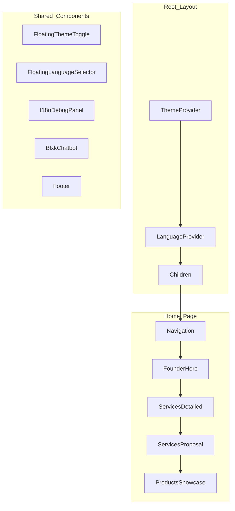

# Análisis Completo de BLXK Studio Website

## 1. Resumen Ejecutivo

**Proyecto**: BLXK Studio Website  
**Versión**: 2.0.0  
**Tipo**: Website corporativo / Portafolio de servicios tecnológicos  
**Ubicación**: https://blxkstudio.com  
**Tech Stack Principal**: Next.js 16.1.3 + React 19.2.0 + TypeScript

---

## 2. Arquitectura Técnica

### 2.1 Stack de Tecnologías

| Categoría | Tecnología | Versión |
|-----------|------------|---------|
| Framework | Next.js | 16.1.3 |
| UI Library | React | 19.2.0 |
| Lenguaje | TypeScript | 5.9+ |
| Estilos | Tailwind CSS | 4.1.17 |
| Animaciones | Framer Motion | 12.0.0 |
| Chatbot | AI SDK | 4.1.0 |
| AI Provider | OpenAI | 1.1.0 |
| Email | Resend | 4.0.0 |
| Automatización | n8n | Integration |
| Analytics | Vercel Analytics | 1.6.1 |
| Performance | Vercel Speed Insights | 1.2.0 |
| Testing | Vitest | 4.1.0 |
| E2E Testing | Playwright | 1.58.2 |

### 2.2 Estructura del Proyecto

```
blxkstudiopage/
├── app/                          # Next.js App Router
│   ├── layout.tsx               # Root layout con providers
│   ├── page.tsx                 # Homepage
│   ├── [locale]/                # Páginas con i18n
│   │   ├── servicios/
│   │   │   └── [slug]/
│   │   ├── proyectos/
│   │   ├── nosotros/
│   │   ├── contacto/
│   │   ├── seguridad/
│   │   ├── plugins-wp/
│   │   └── stack/
│   └── api/                     # API Routes
│       ├── chat/
│       ├── chatbot-webhook/
│       ├── n8n-webhook/
│       └── send-email/
├── components/
│   ├── home/                    # Componentes específicos del home
│   ├── layout/                  # Navigation, Footer, Theme
│   ├── ui/                      # shadcn/ui components
│   ├── services-detailed.tsx    # Servicios principales
│   └── security/                # Sección de seguridad
├── lib/
│   ├── i18n/                    # Sistema de internacionalización
│   ├── integrations/            # Integraciones (n8n, OpenAI, Resend)
│   └── services-data.ts         # Datos de servicios
├── hooks/                       # Custom React hooks
└── public/                      # Assets estáticos
```

---

## 3. Análisis de Funcionalidades

### 3.1 Sistema de Internacionalización (i18n)

**Idiomas soportados**: 7
- Español (es) - Por defecto
- Inglés (en)
- Portugués (pt)
- Francés (fr)
- Alemán (de)
- Italiano (it)

**Características**:
- Detección automática de idioma por cookies/headers
- Selector de idioma flotante (FloatingLanguageSelector)
- SEO multilingual con metadata dinámica
- URL routing basada en locale (/es/, /en/, /pt/, etc.)
- JSON-LD específico por idioma

**Archivos relacionados**:
- [`lib/i18n/core.ts`](lib/i18n/core.ts) - Lógica principal
- [`lib/i18n/config.ts`](lib/i18n/config.ts) - Configuración
- [`components/layout/language-provider.tsx`](components/layout/language-provider.tsx) - Provider
- [`components/layout/language-floating.tsx`](components/layout/language-floating.tsx) - Selector UI

### 3.2 Chatbot Inteligente

**Arquitectura**: 
- Frontend: Componente React con AI SDK
- Backend: n8n workflow para procesamiento
- Webhooks bidireccionales para comunicación

**Características del chatbot**:
- Integración con OpenAI para respuestas inteligentes
- Manejo de conversaciones via webhook
- Sistema de "owner response" para intervención manual
- Timeout de 2 minutos para respuestas automáticas
- Historial de chat con persistencia

**Archivos relacionados**:
- [`components/home/blxk-chatbot.tsx`](components/home/blxk-chatbot.tsx) - UI del chatbot
- [`n8n-chatbot-config.json`](n8n-chatbot-config.json) - Configuración n8n
- [`app/api/chat/route.ts`](app/api/chat/route.ts) - API de chat
- [`app/api/chatbot-webhook/route.ts`](app/api/chatbot-webhook/route.ts) - Webhook

### 3.3 Servicios Ofrecidos

El sitio promociona 7 servicios principales:

1. **Páginas Web Profesionales** - Sitios de alto rendimiento con Next.js
2. **Páginas Corporativas** - Presencia institucional empresarial
3. **E-commerce de Alto Rendimiento** - Tiendas online con conversiones optimizadas
4. **BLXK LMS** - Plataformas educativas estilo Udemy
5. **BLXK Automations** - Automatización con IA y n8n
6. **Homers** - Sistema integral para restaurantes
7. **TAS** - Sistema de logística y transporte

**Datos en**: [`lib/services-data.ts`](lib/services-data.ts) - 638 líneas de datos estructurados

### 3.4 SEO y Metadata

**Implementaciones**:
- Metadata dinámica con OpenGraph
- Twitter Cards configuradas
- JSON-LD Schema.org (Organization, Person, WebSite)
- Canonical URLs
- Sitemap automático
- Robots.txt configurado
- Dublin Core metadata

**Archivos de SEO**:
- [`app/sitemap.ts`](app/sitemap.ts)
- [`app/robots.ts`](app/robots.ts)
- [`app/opengraph-image.tsx`](app/opengraph-image.tsx)
- [`app/twitter-image.tsx`](app/twitter-image.tsx)

### 3.5 Sistema de Temas

- Dark/Light mode con ThemeProvider
- Persistencia en cookies
- Toggle flotante en la UI
- CSS variables para theming
- Soporte para prefers-color-scheme

---

## 4. Páginas del Sitio

### 4.1 Estructura de Rutas

| Ruta | Descripción | Estado |
|------|-------------|--------|
| `/` | Homepage principal | ✅ Activa |
| `/es`, `/en`, `/pt`, etc. | Versiones i18n | ✅ Activas |
| `/servicios` | Lista de servicios | ✅ Activa |
| `/servicios/[slug]` | Detalle de servicio | ✅ Activa |
| `/proyectos` | Portafolio de proyectos | ✅ Activa |
| `/nosotros` | Sobre la empresa | ✅ Activa |
| `/contacto` | Página de contacto | ✅ Activa |
| `/seguridad` | Servicios de seguridad | ✅ Activa |
| `/plugins-wp` | Plugins de WordPress | ✅ Activa |
| `/stack` | Stack tecnológico | ✅ Activa |
| `/terms` | Términos y condiciones | ✅ Activa |
| `/privacy` | Política de privacidad | ✅ Activa |

---

## 5. API Routes

### 5.1 Endpoints Disponibles

| Endpoint | Método | Función |
|----------|--------|---------|
| `/api/chat` | POST | Chat con AI |
| `/api/chatbot-webhook` | POST | Webhook del chatbot |
| `/api/n8n-webhook` | POST | Integración n8n |
| `/api/send-email` | POST | Envío de emails (14KB+) |

### 5.2 Integraciones Externas

- **Resend**: Servicio de email transaccional
- **OpenAI**: GPT para chatbot
- **n8n**: Automatización de workflows
- **Vercel**: Hosting y analytics

---

## 6. Configuración de Seguridad

### 6.1 Headers HTTP

El sitio implementa headers de seguridad robustos:

- `Content-Security-Policy` (CSP)
- `X-Content-Type-Options: nosniff`
- `X-Frame-Options: DENY`
- `X-XSS-Protection: 1; mode=block`
- `Referrer-Policy: strict-origin-when-cross-origin`
- `Strict-Transport-Security` (HSTS - 1 año)
- `Permissions-Policy` (restricciones de hardware)

### 6.2 Optimizaciones de Cache

- Imágenes: 1 año (immutable)
- JS/CSS: 1 año (immutable)
- MinimumCacheTTL: 1 año para imágenes

---

## 7. Componentes UI

### 7.1 Biblioteca de Componentes

El proyecto usa **shadcn/ui** con el estilo "new-york":

- Button (variantes: default, outline, ghost, link)
- Card (card, card-header, card-content, card-footer)
- Input
- Textarea
- Lucide Icons

### 7.2 Componentes Personalizados

| Componente | Ubicación | Descripción |
|------------|-----------|-------------|
| FounderHero | home/ | Hero section con founder |
| ServicesDetailed | root | Grid de servicios |
| ProductsShowcase | home/ | Showcase de productos |
| ProjectDemos | home/ | Demos de proyectos |
| ServicesProposal | home/ | Propuesta de servicios |
| Navigation | layout/ | Navbar principal |
| Footer | layout/ | Pie de página |
| ThemeToggle | layout/ | Selector de tema |
| SecurityServices | security/ | Servicios de seguridad |
| ProjectsShowcase | projects/ | Portafolio |

---

## 8. Rendimiento

### 8.1 Optimizaciones Implementadas

- ✅ Code splitting automático con Next.js
- ✅ Lazy loading de componentes bajo el fold
- ✅ Skeleton loading para mejor UX
- ✅ Image optimization con AVIF/WebP
- ✅ Font optimization (Geist con display: swap)
- ✅ DNS prefetch para fuentes externas
- ✅ Dynamic imports con Suspense

### 8.2 Core Web Vitals

Basado en la configuración, el sitio apunta a:
- **LCP**: < 2.5s (optimizado)
- **FID**: < 100ms
- **CLS**: < 0.1
- **Speed Index**: < 3.4s

---

## 9. Hallazgos y Observaciones

### 9.1 Fortalezas ✅

1. **Tech Stack moderno**: Next.js 16 + React 19 + Tailwind 4
2. **i18n completo**: 7 idiomas con detección automática
3. **SEO robusto**: Schema.org, OpenGraph, Twitter Cards
4. **Seguridad**: Headers CSP, HSTS, X-Frame-Options
5. **Rendimiento**: Lazy loading, optimización de imágenes
6. **Chatbot avanzado**: Integración con AI y n8n
7. **UX**: Theme toggle, skeleton loading, animaciones
8. **TypeScript**: 100% tipado
9. **Testing**: Vitest + Playwright configurados

### 9.2 Áreas de Mejora ⚠️

1. **Componentes vacíos**: Algunos archivos en `components/` tienen solo 60-70 caracteres (posiblemente stubs)
2. **Mensajes i18n**: Los archivos de mensajes (`es.ts`, `en.ts`, etc.) tienen solo 66 caracteres - posiblemente incompletos
3. **Debug Panel**: El `I18nDebugPanel` está en producción - debería ocultarse
4. **API de email grande**: El archivo `send-email/route.ts` tiene 14KB+ - revisar tamaño
5. **Dependencies versions**: Algunas dependencias usan `^` lo cual puede causar inconsistencias

### 9.3 Warnings Potenciales

1. **Scripts inline**: CSP permite `'unsafe-inline'` - revisar necesidad
2. **Analytics**: Scripts de Vercel en CSP pero externos
3. **Imágenes**: En `public/` hay archivos grandes (videos MP4 de 2MB+)

---

## 10. Recomendaciones

### Prioridad Alta

1. **Completar mensajes i18n**: Revisar que todos los idiomas tengan contenido
2. **Ocultar I18nDebugPanel en producción**: Añadir condición de environment
3. **Optimizar videos**: Comprimir o usar servicios externos (Vimeo, YouTube embeds)
4. **Revisar componentes vacíos**: Completar o eliminar stubs

### Prioridad Media

1. **Añadir tests unitarios**: Coverage para componentes críticos
2. **E2E tests**: Completar configuración Playwright
3. **Monitoring**: Configurar error boundaries adicionales
4. **Analytics events**: Track de conversiones específicas

### Prioridad Baja

1. **Service Worker**: Añadir PWA capabilities
2. **A/B Testing**: Implementar实验 para conversiones
3. **Analytics avanzado**: Custom events para KPIs de negocio

---

## 11. Diagramas de Arquitectura

### 11.1 Flujo de Usuario y Chatbot

```mermaid
graph TB
    subgraph Frontend
        A[Usuario] --> B[Navigation]
        B --> C[FounderHero]
        C --> D[ServicesDetailed]
        D --> E[BlxkChatbot]
    end
    
    subgraph API Layer
        E --> F[/api/chat]
        F --> G[OpenAI SDK]
        G --> F
        F --> E
    end
    
    subgraph n8n Integration
        F --> H[n8n Webhook]
        H --> I[Chatbot Workflow]
        I --> J[Process Message]
        J --> K[AI Response]
        K --> H
    end
    
    subgraph Email
        L[Contact Form] --> M[/api/send-email]
        M --> N[Resend API]
    end
```

### 11.2 Estructura de Componentes



---

## 12. Métricas del Proyecto

| Métrica | Valor |
|---------|-------|
| Total de archivos | 100+ |
| Líneas de código (estimadas) | 50,000+ |
| Páginas | 15+ |
| Componentes | 40+ |
| API routes | 4 |
| Idiomas | 7 |
| Dependencias | 25+ |
| Scripts npm | 8 |

---

*Documento generado automáticamente para BLXK Studio Website*
*Fecha de análisis: 2026-03-14*
